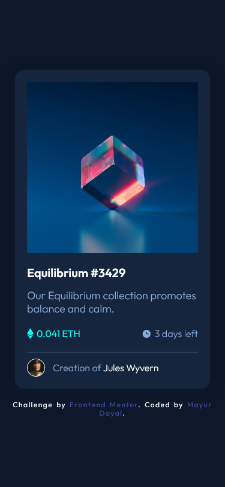
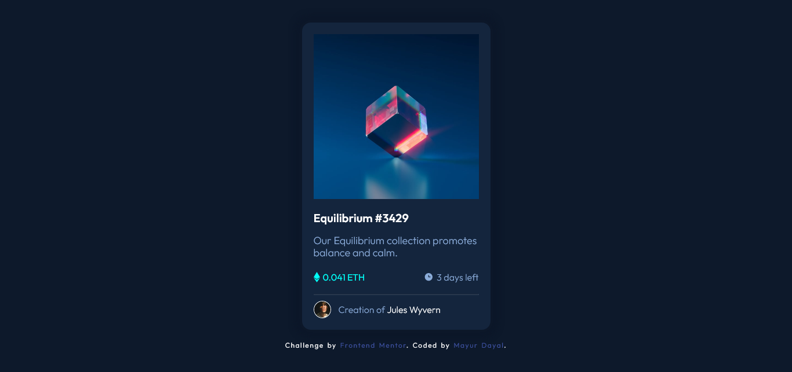

# Frontend Mentor - NFT preview card component solution

This is a solution to the [NFT preview card component challenge on Frontend Mentor](https://www.frontendmentor.io/challenges/nft-preview-card-component-SbdUL_w0U). Frontend Mentor challenges help you improve your coding skills by building realistic projects. 

## Overview

### The challenge

Users should be able to:

- View the optimal layout depending on their device's screen size
- See hover states for interactive elements

### Instructions

- Clone the repository: 
  git clone https://github.com/mayurDayal5000/nft-preview-card-component-main.git

- Install package.json: 
  npm install

- Render in browser: 
  npm start

### Screenshot

#### Mobile

 

#### Desktop

### Links

- Solution URL: [https://github.com/mayurDayal5000/nft-preview-card-component-main.git](https://github.com/mayurDayal5000/nft-preview-card-component-main.git)
- Live Site URL: [https://nft-preview-card-component-mayur5000.netlify.app/](https://nft-preview-card-component-mayur5000.netlify.app/)

## My process

### Built with

- Semantic HTML5 markup
- CSS custom properties
- Flexbox
- Mobile-first workflow
- [React](https://reactjs.org/) - JS library

<footer>
    
 &copy 2021 mayur 

</footer>